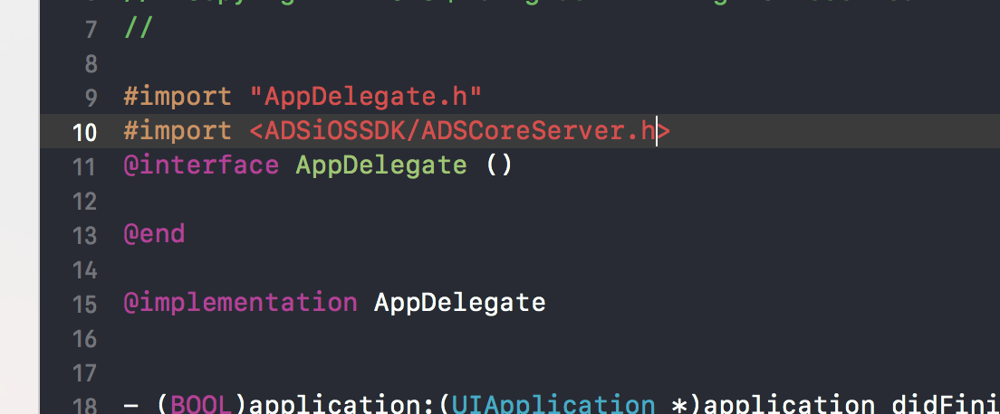

# CPCMobAdSDK

[](https://travis-ci.org/丁昊/CPCMobAdSDK)
[](https://cocoapods.org/pods/CPCMobAdSDK)
[](https://cocoapods.org/pods/CPCMobAdSDK)
[](https://cocoapods.org/pods/CPCMobAdSDK)


## 安装

CPCMobAdSDKTest is available through [CocoaPods](https://cocoapods.org). To install
it, simply add the following line to your Podfile:

```ruby
pod 'CPCMobAdSDK'
```

## 作者

丁昊, dinghao@qutoutiao.net

## License

CPCMobAdSDKTest is available under the MIT license. See the LICENSE file for more info.


CPCMobAdSDK iOS 接口文档
=============

#	1.0 SDK介绍
提供请求接口 ,通过广告位ID ,广告位类型 ,尺寸等 获取广告
SDK包含**真机**和**模拟器**两种架构
#	2.0 SDK要求
最低支持iOS **8.0**
关闭 bitcode
添加 -ObjC

#	3.0 SDK接入方式
##	3.1导入SDK 和Bundle文件

##	3.2导入头文件

##	3.3初始化SDK

##	3.4获取ADViewModel

##	3.5获取ADView

##	3.6获取Height


##	3.7 添加-ObjC


#	4.0 接口说明

##	4.1  sharedInstance
	+ (ADSCoreServer *)sharedInstance;
###	4.1.1	解释说明
单例方式创建广告SDK对象
###	4.1.2	例
```
[ADSCoreServer sharedInstance]
```

##	4.2  initWithADSKey:
	- (BOOL)initWithADSKey:(NSString *)patchKey;
###	4.2.1	解释说明
初始化SDK ,并传如更新用的秘钥 
###	4.2.2	例:
```
    [[ADSCoreServer sharedInstance] initWithADSKey:@"XXXXXX"];
```
###	4.2.3 参数说明


参数 | 说明
--------- | -------------
patchKey | 秘钥 ,目前可随意传值


##	4.3 getAdViewWithParameters:delegate:adViewSetting: success: failure: 
	- (void)getAdViewWithParameters:(NSDictionary *)parameters delegate:(id)delegate adViewSetting:(NSDictionary *)setDic success:(void ( ^ )(UIView * adView))success failure:(void ( ^ ) (NSError * error))failure; 

###	4.3.1	解释说明:
输入参数，并异步返回广告UIViev。
###	4.3.2	例:
```
[[ADSCoreServer sharedInstance] getAdViewWithParameters:adBody delegate:self adViewSetting:setBody success:^(UIView *adView) {
        
    } failure:^(NSError *error) {
        
    }];

```
###	4.3.4	参数说明

参数 | 说明
--------- | -------------
parameters | 请求广告必要的请求广告必要的NSDictionary 如下:
delegate 	| 需要从此跳转的UIViewController
adViewSetting 	| setDic 配置参数
success		| 广告请求成功的回调
failure|广告请求失败,或者无广告的回调

```
NSMutableDictionary * adbody = [[NSMutableDictionary alloc]initWithCapacity: 4];
    
    [adBody setObject:@"5000188" forKey:@"id"];
    [adBody setObject:@(1) forKey:@"type"];
    [adBody setObject:@(100) forKey:@"height"];
    [adBody setObject:@(200) forKey:@"width"];
```
parameters字典| 说明
--------- | -------------
id | 广告位id
type 	| 广告位类型
width		| 广告位宽度尺寸
height|广告位高度尺寸

adViewSetting|说明
--------- | -------------
titleImageOffset|标题到图片的间距
imageOffset|图片间距
edgeInset|上下左右边距
clickSize|点击区域大小(米读小说用)
picType|左图还是右图(米读小说用)


###	4.3.5	广告位id
parameters字典| 说明
--------- | -------------
7277638 | 组图测试广告位 
7479036 	| 图文测试广告位  
7112926		| 大图测试广告位

##	4.4	getADModel:pushController:adViewSetting:success:failure:
	- (void)getADModel:(NSDictionary *)parameter  pushController:(UIViewController *)push adViewSetting:(NSDictionary *)setDic success:(void ( ^ )(NSObject * adViewModel))success failure:(void ( ^ )(NSError * error))failure;
###	4.4.1	解释说明
 通过传递请求参数和配置参数 , 以及跳转的的页面控制器 , 返回物料model
###	4.4.2	例:
```
  NSMutableDictionary * adBody = [[NSMutableDictionary alloc]initWithCapacity: 4];
    [adBody setObject:[NSString stringWithFormat:@"7277638"] forKey:@"id"];


    UIEdgeInsets edgeInset;
    edgeInset.top = 5;
    edgeInset.left = 10;
    edgeInset.right = 10;
    edgeInset.bottom = 10;


    NSMutableDictionary * setBody = [NSMutableDictionary dictionary];
    [setBody setObject:@(10) forKey:@"titleImageOffset"];
    [setBody setObject:@(3) forKey:@"imageOffset"];
    [setBody setObject:[NSValue valueWithUIEdgeInsets:edgeInset] forKey:@"edgeInset"];
    [setBody setObject:@"right" forKey:@"picType"];
    [setBody setObject:[UIFont systemFontOfSize:20] forKey:@"titleFont"];
    
    
     [[ADSCoreServer sharedInstance] getADModel:adBody pushController:self adViewSetting:setBody success:^(NSObject *adViewModel) {
        
    } failure:^(NSError *error) {
        
    }]
```
###	4.4.3 参数说明

参数 | 说明
--------- | -------------
parameters | 请求广告必要的请求广告必要的NSDictionary 如下:
push 	| 需要从此跳转的UIViewController
setDic 	| setDic 配置参数
success		| 广告请求成功的回调 ,返回物料model
failure|广告请求失败,或者无广告的回调

```
NSMutableDictionary * adbody = [[NSMutableDictionary alloc]initWithCapacity: 4];
    
    [adBody setObject:@"5000188" forKey:@"id"];

```
parameters字典| 说明
--------- | -------------
id | 广告位id
type 	| 广告位类型
width		| 广告位宽度尺寸
height|广告位高度尺寸

adViewSetting|说明
--------- | -------------
titleImageOffset|标题到图片的间距
imageOffset|图片间距
edgeInset|上下左右边距
clickSize|点击区域大小(米读小说用)
picType|左图还是右图(米读小说用)


###	4.3.5广告位id
parameters字典| 说明
--------- | -------------
7277638 | 组图测试广告位 
7479036 	| 图文测试广告位  
7112926		| 大图测试广告位


##	4.5 adViewForHeight:
	- (CGFloat)adViewForHeight:(NSObject *)adViewModel;
###	4.5.1	解释说明
   根据物料model , 计算ADView的高度 , 如果不用这个方法, 用ADView.frame.size.height 同样可以获取高度
###	4.5.2	例:
```
       CGFloat adHeight = [[ADSCoreServer sharedInstance] adViewForHeight:adViewModel]
```
###	4.5.3 参数说明

参数 | 说明
--------- | -------------
adViewModel | 上一个方法请求回来的adViewmodeol物料

##	4.6 adsShowView:
	- (UIView *)adsShowView:(NSObject *)adViewModel;
###	4.6.1	解释说明
  通过物料model获取广告view 
###	4.6.2	例:
```
         UIView * adView = [[ADSCoreServer sharedInstance] adsShowView:adViewModel];
```
###	4.6.3 参数说明

参数 | 说明
--------- | -------------
adViewModel | getADModel方法请求回来的adViewmodeol物料

##	4.7 setLogEnable:
	+ (void)setLogEnable:(BOOL)flag;

###	4.7.1	解释说明
  log 输出开关 , 默认关闭, YES开启
###	4.7.2	例:
```
   [ADSCoreServer setLogEnable:YES];

```
###	4.7.3 参数说明

参数 | 说明
--------- | -------------
flag | NO:关闭 YES:开启


##	4.8 getLaunchADView:body:window:success:failure:failure;
	- (void)getLaunchADView:(ADSLaunchAdViewConfig *)config
                   body:(NSDictionary *)parameters
                 window:(UIWindow *)window
                success:(void (^)(NSObject * adViewModel))success
                failure:(void (^)(NSError * error))failure;

###	4.8.1	解释说明
  传输请求参数 , 和配置参数 , 请求开屏
  需要放到Appdelegate的 application:didFinishLaunchingWithOptions中 [self.window makeKeyAndVisible]后面
###	4.8.2	例:
```
   self.window = [[UIWindow alloc] initWithFrame:[[UIScreen mainScreen] bounds]];
    UIStoryboard * storyBoard = [UIStoryboard storyboardWithName:@"Main" bundle:[NSBundle mainBundle]];
    self.window.rootViewController = [storyBoard instantiateViewControllerWithIdentifier:@"ViewController"];
    [self.window makeKeyAndVisible];

    /**********************      开屏广告         *****************/
    
    ADSLaunchAdViewConfig * config = [[ADSLaunchAdViewConfig alloc]init];
    config.waitTime = 2.5;
    config.showTime = 6;
    config.animate =  1;
    
    NSMutableDictionary * adBody = [[NSMutableDictionary alloc]initWithCapacity: 4];
    [adBody setObject:@"7090271" forKey:@"id"];
    
    [ADSCoreServer sharedInstance].launchDelegate = self;
    [[ADSCoreServer sharedInstance] getLaunchADView:config body:adBody window:self.window success:^(NSObject *adViewModel) {
        
    } failure:^(NSError *error) {
        
    }];
    
    /**********************      开屏广告         *****************/

```
###	4.8.3 参数说明

参数 | 说明
--------- | -------------
config | NO:关闭 YES:开启
parameters | 请求必要参数
window | 当前的window
failure | 失败回调


##	4.9 adsConfigWithFont:
	- (void)adsConfigWithFont:(UIView *)adView font:(UIFont*)font;
###	4.9.1	解释说明
  提供广告对象, 和font对象, 改变广告界面的字体
###	4.9.2	例:

```
        UIView * adView = [self.adViewArr objectAtIndex:i];
        [[ADSCoreServer sharedInstance] adsConfigWithFont:adView font:[UIFont systemFontOfSize:fontSize]];
```
###	4.9.3 参数说明

参数 | 说明
--------- | -------------
adView | 广告对象
font | 字体对象

